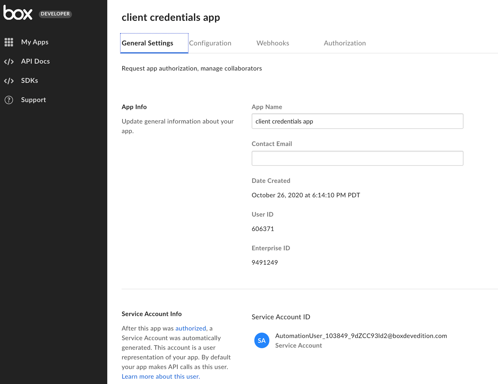

# Service Accounts

A Service Account provides developers with a programmatic authentication
mechanism for server-side integrations with Box. In other words, an application
can authenticate to Box as the service, which is represented by a Service
Account user. A Service Account can then be used to create other application
specific users, called [App Users][appusers].

<ImageFrame center shadow border>

</ImageFrame>

## Creation

A unique Box Service Account is automatically generated as soon as an
application, leveraging server authentication, is [authorized][auth] in the
Admin Console. From that point forward, the Service Account represents the
application in the Box enterprise. Since every Box account must have an email
address, Box assigns one. The format will always be
`AutomationUser_AppServiceID_RandomString@boxdevedition.com`. For example:
`AutomationUser_123456_6jCo6Pqwo@boxdevedition.com`. This is why you may
sometimes hear the Service Account referred to as an Automation User.

The numbers surrounded by underscores are also unique to the application and are
called a Service ID. To locate a Service ID  in the [Developer Console][dc],
click on the tile for an application and look at the URL. For example,
`https://example.app.box.com/developers/console/app/123456`. As you can see,
this application corresponds to the Service Account provided in the example
above.

By default, most Service Accounts are allocated 10GB of storage. This is because
they abide by the storage allocation set in the **New User Default Settings**
found under the **User Settings** tab of the Admin Console. This amount may
differ based on whether an enterprise updated this setting or not. To
update the amount of storage allocated to a Service Account after its creation,
make an API call to the [update user][updateuser] endpoint and pass in the
desired value, in bytes, using the `space_amount` body parameter.

Once the Service Account is generated, a section is automatically added to the
General tab of the [Developer Console][dc] revealing the email address.

<ImageFrame center shadow border>

</ImageFrame>

If someone attempts to make API calls using a Service Account Access Token
before the application is authorized in the Admin Console they will receive an
error message:
`"error":"unauthorized_client"`
`"error_description": "This app is not authorized by the enterprise"`

## Use Cases

- *Distribution Publishing*: upload and share files with any number of users 
  whether or not they are authenticated
- *On-Premises Systems and Devices*: programmatically ingest content from
  on-premises systems and connected devices 
- *Content Migration and Monitoring*: move content from on-premises to the cloud
  or between cloud providers  
- *Event Monitoring*: monitors events in an enterprise to ensure compliance and or
  trigger workflows based on actions
- *Content Archive*: house minimally accessed content

## Permissions

The endpoints that a Service Account Access Token can successfully interact with
are determined by the application [scopes][scopes] configured in the 
[Developer Console][dc]. Depending on the granted scopes, a Service Account may
have the ability to perform Admin actions. 

<Message type='warning'>

# Admin Approval

With the right [scopes][scopes] enabled, a Service Account can perform many
Admin actions. For this reason JWT applications need
explicit [Admin approval][auth] before they can be used in an enterprise.

</Message>

## UI Access

Only Primary Admins have the ability to log in as a Service Account through the
[Content Manager][cm] in the Admin Console. To do this, use the Content
Manager's search bar to locate the name of the application, right click on it,
and select “Log in to user’s account”.

A Service Account can be thought of as having the permissions of a Box Co-Admin.
Similar to co-admins being unable to manage each other, co-admins cannot log in
as a Service Account user.

Service Accounts are not currently visible in the users and group tab of the
Admin Console.

## Folder Tree and Collaboration

Because a Service Account represents an application as a user within the
enterprise, it has its own folder tree and content ownership capabilities. By
default this folder tree is empty because the Service Account does not initially
own or collaborate on content. This is similar to when you first land on your
All Files page in a newly provisioned Box account.

To collaborate a Service Account on existing content use the assigned email
address to invite them as you would any other user. If you are instead adding
the collaboration [via the API][collabapi] you will need to use an Access Token
for a user that already has access to the content and has the appropriate
collaboration permissions to invite collaborators. You will also use the Service
Account’s user ID, which is returned when making a call to the
[get current user endpoint][getuser] using an Access Token for the Service
Account.

<Message type='notice'>

It is possible to assign a Service Account an email alias if that is
easier to remember when adding collaborations.

</Message>

## Box View

A Service Account is also automatically generated when a Limited Access App is
created in the [Developer Console][dc]. This Service Account has some additional
restrictions that a Service Account associated with a Custom App does not.

- All content used within the Limited Access App must be uploaded and owned by
  the Service Account
- The Service Account can not access any other user's information or content
- The Service Account can not create or otherwise manage any type of new user
- The Service Account can only access a subset of APIs related to previewing
  content

[appusers]: g://getting-started/user-types/app-users/
[auth]: g://authorization/custom-app-approval/
[dc]: https:/app.box.com/developers/console
[scopes]: g://api-calls/permissions-and-errors/scopes/
[cm]: https://support.box.com/hc/en-us/articles/360044197333-Using-the-Content-Manager
[collabapi]: e://post-collaborations/
[getuser]: e://get-users-me/
[updateuser]: e://put-users-id/